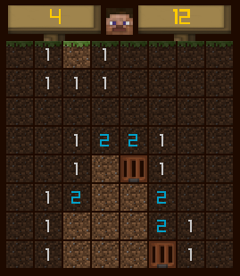
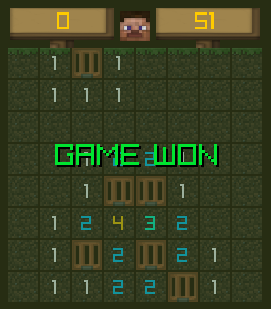

# MineCreeper
A Minesweeper clone in the Minecraft universe written in go and raylib

## Requirements
- [raylib-go](https://github.com/gen2brain/raylib-go) see the [requirements](https://github.com/gen2brain/raylib-go#requirements) of `raylib-go`

## How to run
- run `go get github.com/gen2brain/raylib-go/raylib` to get raylib-go
- run `go run .` within the root folder

## Build release
- run `go build -ldflags "-s -w"`
> Note: To prevent the console window from popping up on Windows add `-H windowsgui` to the linker flags -> `go build -ldflags "-s -w -H windowsgui"`